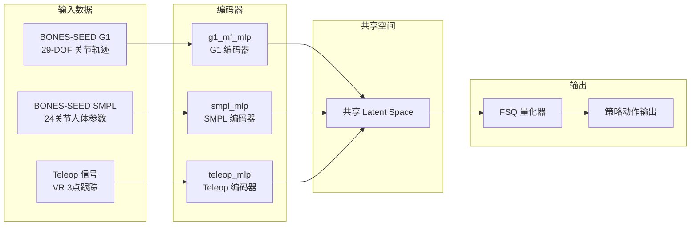

# SMPL 数据集与 BONES-SEED 数据集对比

> 本文档说明 SONIC 训练中两种核心数据集的区别、作用及使用方法。

---

## 一、数据集概览

| 维度 | **BONES-SEED G1** | **BONES-SEED SMPL** |
|------|:-----------------:|:-------------------:|
| **描述对象** | 已重定向到 **G1 机器人** 的关节轨迹 | **原始人体** 骨骼参数 |
| **关节数** | 29 DOF（G1 实际关节） | 24 关节（标准人体） |
| **参数格式** | 关节角度（弧度） | `pose_aa` (72维) + `transl` (3维) |
| **坐标系** | MuJoCo / IsaacLab 机器人坐标系 | SMPL 标准人体坐标系 |
| **数据来源** | SOMA Retargeter 外部预重定向 | BONES-SEED 原始人体捕捉数据 |
| **文件格式** | `.pkl` (motion_lib) | `.pkl` (smplx 格式) |
| **训练配置项** | `motion_file` | `smpl_motion_file` |
| **当前状态** | ⚠️ 下载中（`g1.tar.gz` 23.5GB） | ✅ 就绪（131,455 PKL，31GB） |

---

## 二、在 SONIC 网络中的位置

SONIC 使用 **三个并行编码器**，BONES-SEED G1 和 SMPL 分别走不同的编码路径，最终汇入共享的潜在空间：



---

## 三、为什么需要同时用两种？

### 核心机制：跨模态对齐（Cross-Modal Alignment）

通过 `G1SmplLatentLoss` 强制约束：

> **同一个动作**，无论用 G1 编码器还是 SMPL 编码器，都应映射到相似的 latent 表示。

这形成了一条**模态无关的运动表示链**：

```
SMPL (人体语义空间)  ⟷  Teleop (VR 桥接空间)  ⟷  G1 (机器人关节空间)
```

### 三大实际好处

| 好处 | 说明 |
|------|------|
| **数据互补** | G1 重定向数据需要复杂物理优化、来源有限；SMPL 人体数据集规模更大、更丰富 |
| **泛化增强** | 从人体数据学到的运动模式可迁移到机器人，提高策略泛化性 |
| **未来扩展** | 换到新机器人（如 H1、H2）时，SMPL 编码器可直接复用，无需重新收集 G1 特定数据 |

---

## 四、训练时的采样机制

每个环境重置时，根据配置概率采样一个"原生"模态：

```yaml
encoder_sample_probs:
  g1: 1.0      # 采样 G1 轨迹模态
  teleop: 1.0  # 采样遥操作模态
  smpl: 1.0    # 采样 SMPL 人体模态
```

- **G1-native env**：输入是已重定向的 G1 关节轨迹 → 走 `g1_mf_mlp`
- **SMPL-native env**：输入是原始 SMPL 人体参数 → 走 `smpl_mlp`
- **Teleop-native env**：输入是 VR 遥操作信号 → 走 `teleop_mlp`

三种编码器输出汇入**同一个共享 latent space**，经 FSQ 量化后生成统一的动作 token。

---

## 五、当前项目数据路径

### 文件系统布局

```
data/motion_lib_bones_seed/
├── robot_filtered ──→ /data/wangbin/sample_data/robot_filtered  (⚠️ 仅 2 条 demo motion)
└── smpl_filtered  ──→ /data/wangbin/smpl_filtered              (✅ 131,455 PKL, 31GB)

data/bones_seed_smpl ──→ /data/wangbin/smpl_filtered            (✅ 同上)
```

### 训练配置路径

```yaml
# gear_sonic/config/exp/manager/universal_token/all_modes/sonic_release.yaml

motion_lib_cfg:
  motion_file: data/motion_lib_bones_seed/robot_filtered      # G1 数据（主输入）
  smpl_motion_file: data/bones_seed_smpl                       # SMPL 数据（辅助输入）
```

---

## 六、如果没有 SMPL 数据会怎样？

可以设 `smpl_motion_file: dummy`，此时：

- SMPL 编码器输入为零 → 输出无意义的 latent
- `G1SmplLatentLoss` 会把 G1 latent 拉向零，**对训练有害**
- 训练代码会自动检测并避开 SMPL 采样（`encoder_sample_probs_no_smpl`）

**结论**：没有 SMPL 可以训练，但效果会下降。建议至少保留 SMPL 数据用于跨模态对齐。

---

## 七、一句话总结

> **BONES-SEED G1 让策略"看懂机器人怎么动"，SMPL 让策略"看懂人怎么动"，两者结合学到的是"模态无关的通用运动理解"。**
